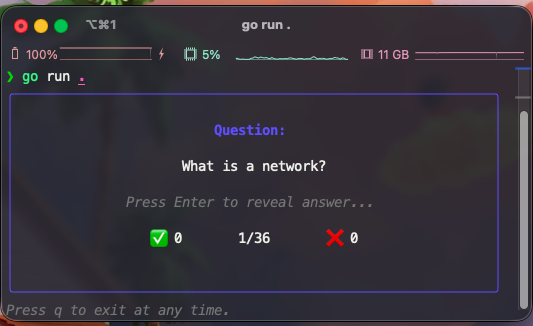
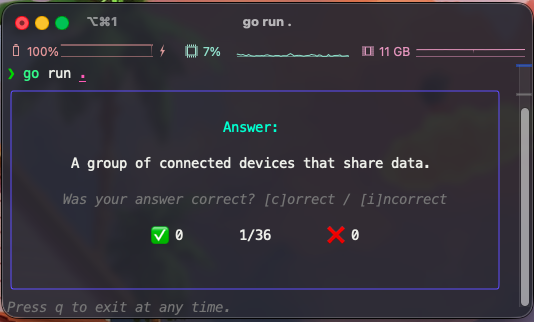
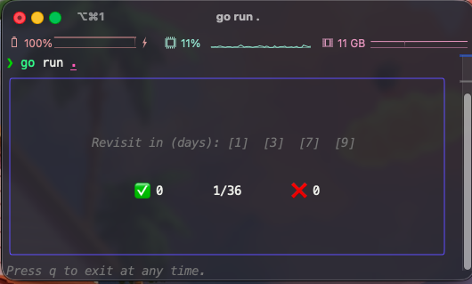
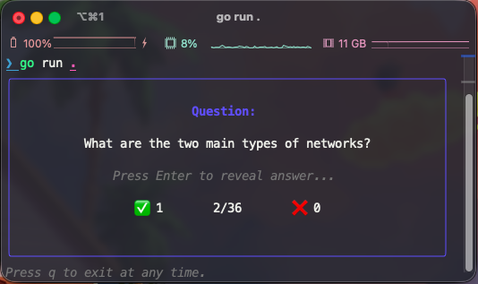

<p align="center">

</p>

<p align="center">
<a href="https://codecov.io/gh/luiz1361/catv"></a>
<a href="https://github.com/luiz1361/catv/issues"></a>
<a href="https://github.com/luiz1361/catv/stargazers"></a>
<a href="https://github.com/luiz1361/catv/network"></a>
<a href="https://github.com/luiz1361/catv/releases"></a>
<a href="https://github.com/luiz1361/catv/actions/workflows/ci.yml"></a>
<a href="https://github.com/luiz1361/catv/actions/workflows/release.yml"></a>
<a href="https://goreportcard.com/report/github.com/luiz1361/catv"></a>
<a href="LICENSE"></a>
<a href="https://github.com/luiz1361/catv/releases"></a>
<a href="go.mod"></a>
<a href="https://buymeacoffee.com/luiz1361"></a>
</p>


CATV (Cards Against The Void) is a fast, minimal command-line tool for turning your notes into interactive flashcards and reviewing them with spaced repetition. Simply point CATV at your folder of markdown notes, and it uses Ollama's local AI models (LLMs) to automatically generate flashcards and quiz you in a colorful terminal interface. CATV is written in Go for minimal dependencies—all you need is the Ollama App from [ollama.com](https://ollama.com) and the compiled binary from this repository. No cloud, no subscriptions, no hidden costs.

**Why CATV?**
- Effortlessly convert your markdown notes into flashcards using local AI (LLM)
- Review and reinforce knowledge with spaced repetition
- Enjoy a distraction-free, user-friendly terminal experience
- 100% private: your notes and flashcards never leave your device
- Secure and offline: no internet required, no data sent to third parties
- Free and open-source: no hidden costs or paywalls

Designed for simplicity, privacy, and security. Runs entirely offline and stores your cards locally in a SQLite database. It was developed and tested on macOS, but works on any platform that supports the Ollama App.

## Quick Start


1. **Install Ollama Desktop:**
  - Download and install from [ollama.com](http://ollama.com/)

2. **Pull the llama3.1 model:**
  ```bash
  ollama pull llama3.1
  ```

3. **Install CATV:**
  ```bash
  curl -fsSL https://raw.githubusercontent.com/luiz1361/catv/refs/heads/main/install.sh | bash
  ```

4. **Generate flashcards from your markdown notes**

  ```bash
  # From a directory (recursive)
  ./catv generate --path /path/to/notes

  # From a single file
  ./catv generate --path /path/to/notes/file.md
  ```

5. **Review your flashcards:**
  ```bash
  ./catv
  ```

That's it! No extra configuration needed. It will use the local Ollama API and store flashcards in a SQLite database.


## Features

| Feature                        | Description                                         |
|--------------------------------|-----------------------------------------------------|
| AI Flashcard Generation        | Create flashcards from markdown using Ollama AI      |
| Spaced Repetition Review       | Review cards with spaced repetition algorithm        |
| Terminal User Interface        | Colorful, user-friendly TUI for reviewing cards      |
| SQLite Storage                 | Flashcards stored locally in SQLite database         |
| No Extra Configuration         | Works out-of-the-box with minimal setup              |

## FAQ
<details>
<summary>What are the system requirements?</summary>
Tested on a MacBook M2 with 16GB of RAM using the llama3.1 model. Performance and compatibility may vary on other systems.
</details>

<details>
<summary>What platforms are supported?</summary>
Any platform supported by the Ollama App (tested on macOS)
</details>

<details>
<summary>Do I need an internet connection?</summary>
No, Ollama runs locally.
</details>

<details>
<summary>Where are flashcards stored?</summary>
Flashcards are stored in a local SQLite database file located at <code>~/.catv/flashcards.db</code>.
</details>

<details>
<summary>Can I use my own markdown files?</summary>
Yes, just point CATV to your folder containing your markdown files.
</details>

<details>
<summary>How do I update the Ollama model?</summary>
Use `ollama pull <model>` to update or change models.
</details>

<details>
<summary>How do I change the default Ollama model?</summary>
You can use the `--model` flag to specify the Ollama model for flashcard generation.
</details>

## Screenshots

Below are some screenshots of CATV in action:









## Contributing
See [CONTRIBUTING.md](CONTRIBUTING.md).

## License
See [LICENSE](LICENSE).